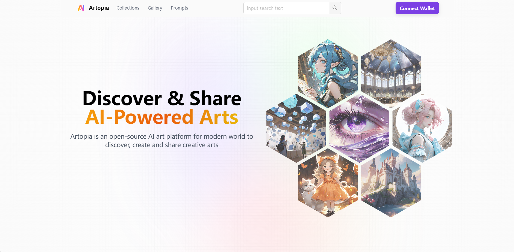
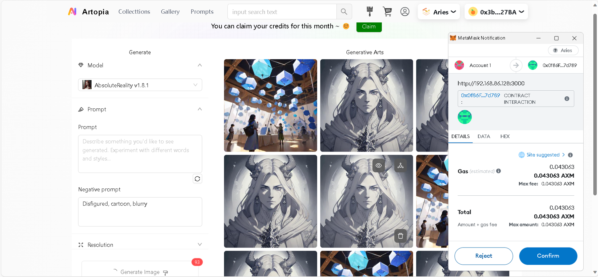

# Artopia
## Introduction
This platform welcomes everyone to join in the creation, trading, and investment of NFTs. Artists can showcase their talent by minting their digital art as NFTs, while collectors can discover and invest in a wide range of unique and captivating digital artworks.

It guides users through the process of creating and listing their NFTs, offering intuitive tools and features that facilitate the creation of NFTs, making it accessible to users with varying levels of technical expertise.

## Intended Users
- Artists interested in generating AI-assisted art
- Collectors and investors seeking  NFTs
- Tech-savvy individuals intrigued by AIGC technology
- Ethereum enthusiasts and blockchain users

## General Architecture

## Tech Stack
### Frontend
React, Next.js

### Wallet Connection and Contract Interaction 
Rainbowkit, wagmi, viem

### Backend
MongoDB

### Contract Development
Solidity

### IPFS
Pinata

## Functionality
- AI-generated Images
- User Collections
- Sharing
- Copyright Protection
- Mint
- Auction on NFTs
- Sell NFTs

## Test and Deployment
For testing, you can directly visit this website: https://artopia-one.vercel.app/. Remember to install MetaMask and add [Aries testnet](https://docs.axiomesh.io/en/documentation/getting-started/resources/resources).

If you want to deploy this project on your own, please refer to the .env_example file in /client and /contract and create your own .env file. You'll also have to redeploy smart contracts.